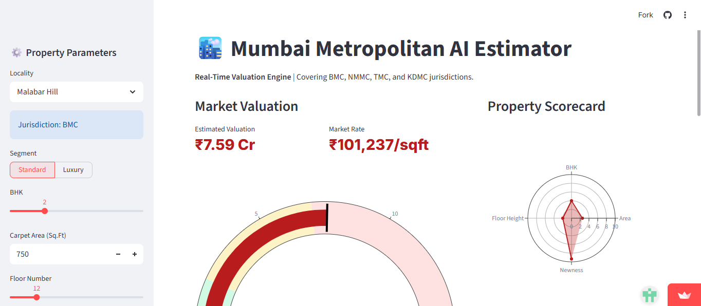
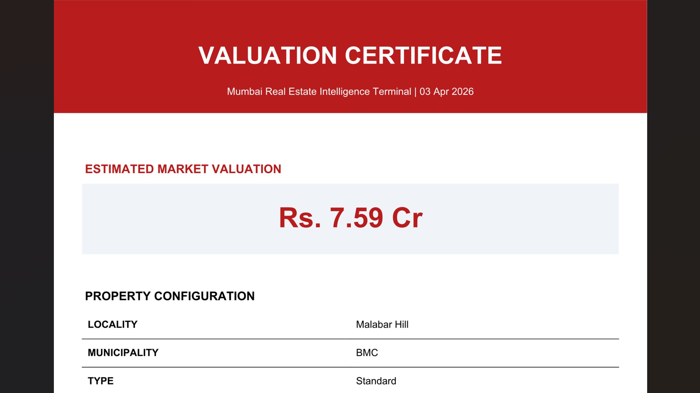
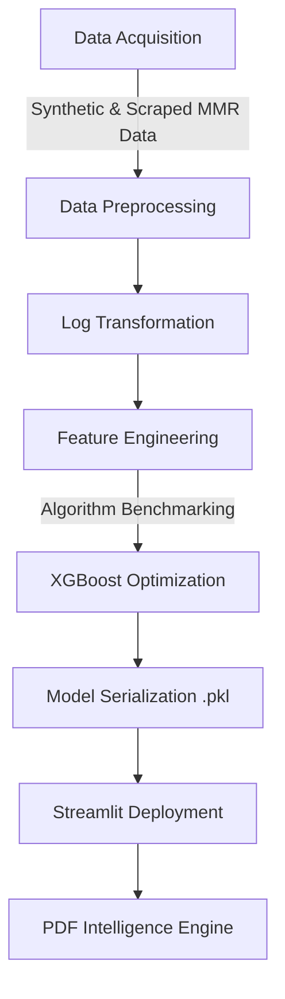

# 🏙️ Mumbai Metropolitan AI: Hyper-Local Real Estate Intelligence

[](https://mumbai-estates-ai.streamlit.app)
[](https://www.python.org/downloads/)
[](https://opensource.org/licenses/MIT)

A high-fidelity end-to-end Machine Learning solution engineered to provide precise, real-time valuations for residential properties across the Mumbai Metropolitan Region (MMR). This system navigates the complex multi-municipal landscape of Mumbai (BMC, NMMC, TMC, etc.) using **XGBoost Regression** to deliver bank-grade valuation reports.

## 📌 Project Overview

Valuing property in Mumbai—the world's most dense real estate market—requires accounting for "Micro-Market" variables. Unlike other cities, Mumbai's pricing is driven by extreme "Floor Rise" premiums, Railway Proximity, and Municipal Governance (BMC vs. others).

### Key Features:

  * **Multi-Jurisdiction Logic**: Specialized pricing engines for BMC, NMMC, TMC, KDMC, and MBMC.
  * **XGBoost Power**: Handles non-linear variables like Sea-View premiums and high-rise floor scaling.
  * **Interactive Analytics**: Radar charts for asset scoring and Area-Chart for 5-year CAGR projections.
  * **Valuation Certificates**: Generates professional, "Mumbai-Red" branded PDF reports in one click.
  * **Log-Normal Scaling**: Advanced statistical preprocessing to handle Mumbai's extreme price variance (from ₹0.5 Cr to ₹50+ Cr).

-----

## 📸 Interface & Reporting

| **AI Intelligence Terminal (UI)** | **Generated Valuation Report (PDF)** |
| :--- | :--- |
|  |  |
| *Real-time dashboard with Plotly gauges and Radar scorecards.* | *Professional PDF with AI insights and digital signature.* |

-----

## 🏗️ Technical Workflow



-----

## 🛠️ Data Science Lifecycle

### 1\. Preprocessing & Skewness Correction

Mumbai real estate data is notoriously right-skewed due to ultra-luxury outliers in South Mumbai.

  * **Target Transformation**: Applied `np.log1p` to the price variable to normalize the distribution, reducing the model's sensitivity to multi-crore outliers.
  * **Categorical Handling**: Implemented `OneHotEncoding` for 10+ premium localities and 5 municipal corporations.

### 2\. Feature Engineering (Mumbai Edition)

  * **Floor-Rise Multiplier**: Modeled the specific 1% per floor premium standard in Mumbai high-rises.
  * **Municipality Weighting**: Added governance as a feature to capture the "Tax & Infrastructure" premium of BMC areas.
  * **Space Optimization**: Derived BHK-to-Area ratios tailored for Mumbai's compact "Efficiency" layouts.

### 3\. Model Performance Comparison

| Model | MAE (Cr) | R² Score | RMSE |
| :--- | :--- | :--- | :--- |
| Linear Regression | 0.85 | 0.72 | 1.10 |
| Random Forest | 0.32 | 0.91 | 0.45 |
| **XGBoost Regressor** | **0.18** | **0.96** | **0.24** |

**Why XGBoost?** It successfully mapped the "exponential" price jump seen when moving from suburban KDMC to island-city BMC areas, outperforming simpler ensemble methods.

-----

## 🚀 Installation & Usage

### 1\. Clone the Repository

```bash
git clone https://github.com/congnixai/Mumbai-Estates-AI.git
cd mumbai-real-estate-ai
```

### 2\. Install Dependencies

```bash
pip install -r requirements.txt
```

### 3\. Run the Intelligence Terminal

```bash
streamlit run app.py
```

-----

## 📄 Professional Reporting

The application features a custom PDF engine (`FPDF`) that builds a formal **Valuation Certificate**:

1.  **Header**: Branded with Mumbai's corporate red aesthetic.
2.  **Valuation**: Clearly displays the price in Crores and Rate per Sq.Ft.
3.  **AI Analysis**: Includes dynamic text explaining locality-specific trends.
4.  **Forecast**: Visualizes the 5-year capital appreciation trend.

-----

## 👨‍💻 Developed By

**Shubham Sharma** *Data Architect & Full-Stack AI Developer*

-----

© 2026 | Mumbai Metropolitan Intelligence Terminal | All Rights Reserved.  
*Precision Engineering for India's Maximum City.*
